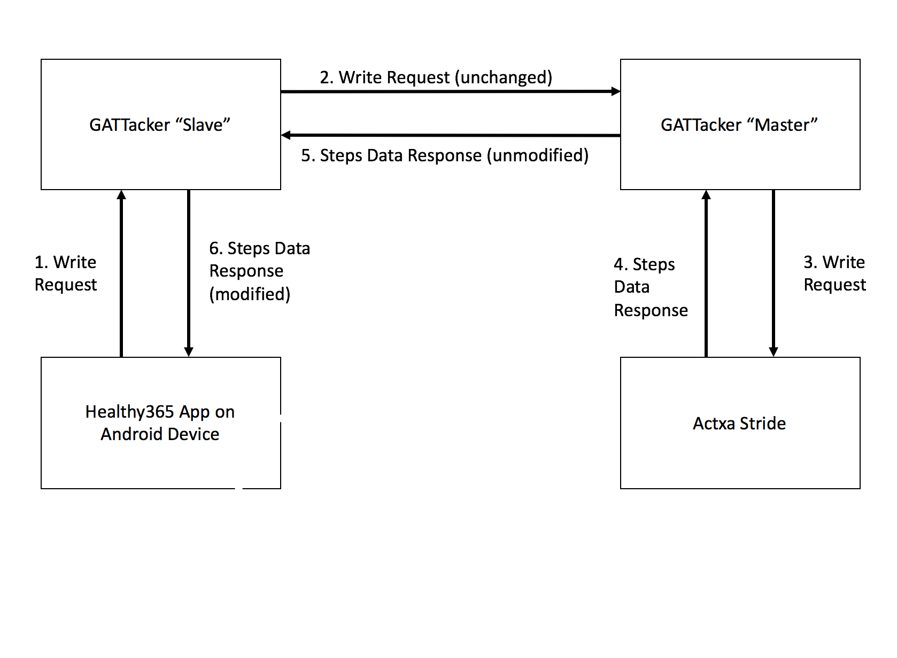

# StepSi
A Step Simulator for the Actxa Stride.
This initiates a man-in-the-middle or Replay attack that will simulate a GATT device (the Actxa Stride), and report any arbitrary number of steps.

## System Requirements
This depends on GATTacker, which requires two linux device (Raspberry Pis are fine) with bluez-compatible bluetooth adapters. This was tested to work with the Raspberry Pi 3's built-in Bluetooth Adapter, although any genuine CSR8510 chip should also work.

## Attack Structure

The attack uses GATTacker to establish a Man-In-The-Middle between the phone and the Actxa Stride, and modifies the steps data response packets using a predefined hookFunction to spoof the step count to the app.

## Replicating the attack
1. Using a tool like Nordic Connect, identify the MAC address of the Actxa Stride.
2. Download [GATTacker](https://github.com/securing/gattacker), and set it up according to the instructions given.
3. Compile and install bdaddr if it is not already installed on the designated GATTacker slave device (refer to the diagram above).
4. Run `sudo ./btswitch.sh 88:88:88:88:88:88`, replacing the MAC address with that of the Actxa stride that you identified above.
5. On the slave machine, copy the two `stride.*.json` files into the /devices folder, and `hackSteps.js` into the hookFunctions folder.
6. On the slave machine, run the command `sudo node advertise -a devices/stride.adv.json -s devices.stride.srv.json`
7. On the master machine, run `ws-slave`.
8. If everything is set up correctly, all requests from the Healthy365 app should now read the modified step count. Enjoy your NTUC vouchers!

## Troubleshooting
If a direct connection is being established between the app and steps tracker, try moving them further apart, or put the steps tracker in a metal box along with the GATTacker master device. The two GATTacker devices need only be connected with an Internet connection, which has a larger range than the BLE connection
